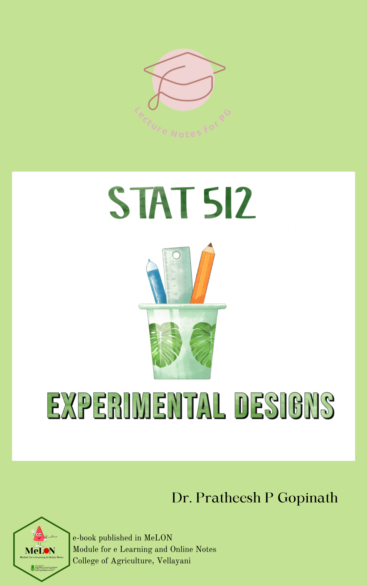

---
title: "LECTURE NOTES OF STAT 512"
author: "Dr. Pratheesh P. Gopinath"
date: "2022-01-30"
site: bookdown::bookdown_site
documentclass: book
bibliography: [book.bib]
biblio-style: apalike
link-citations: yes  
github-repo: https://github.com/KAUMELON/stat512
description: "A BOOK FOR POST GRADUATE PROGRAMME IN AGRICULTURE"
cover-image: images/cover.PNG
---  
 

# Welcome {-} 
<p style="text-align: center;"><a href="https://coavellayani.kau.in/people/dr-pratheesh-p-gopinath"></a></p>  
Welcome to the book **LECTURE NOTES ON EXPERIMENTAL DESIGNS**.

# Preface {-}  

<p style="text-align: justify;"> **Note**: This book is published in MeLoN (Module for e-Learning & Online Notes) . The online version of this book is free to read here.</p> 
````{=html}
<a rel="license" href="http://creativecommons.org/licenses/by-nc-nd/4.0/"></a><br />This work is licensed under a <a rel="license" href="http://creativecommons.org/licenses/by-nc-nd/4.0/">Creative Commons Attribution-NonCommercial-NoDerivatives 4.0 International License</a>.
````
<p>If you have any feedback, please feel free to contact [Dr.Pratheesh P. Gopinath](https://coavellayani.kau.in/people/dr-pratheesh-p-gopinath). E-mail: `pratheesh.pg@kau.in` Thank you!</p>  

<p>This book is a collection of all lecture notes covering the syllabus of EXPERIMENTAL DESIGNS, which is a common course of statistics in Post graduate programmes in Agriculture under Kerala Agricultural University </p>  

**Syllabus**  

**Objective**  

This course is meant for students of agricultural and animal sciences other than Agricultural Statistics. Designing an experiment is an integrated component of research in almost all sciences. The students would be exposed to concepts of Design of Experiments so as to enable them to understand the concepts involved in planning, designing their experiments and analysis of experimental data.  

**Theory**  

_UNIT I _  

Need for designing of experiments, characteristics of a good design. Basic principles of designs - randomization, replication and local control.  

_UNIT II_  

Uniformity trials, size and shape of plots and blocks; Analysis of variance; Completely randomized design, randomized block design and Latin square design.  

_UNIT III_ 

Factorial experiments, (symmetrical as well as asymmetrical). orthogonality and partitioning of degrees of freedom, Confounding in symmetrical factorial experiments, Factorial experiments with control treatment.  

_UNIT IV_ 

Split plot and strip plot designs; Analysis of covariance and missing plot techniques in randomized block and Latin square designs; Transformations, crossover designs, balanced incomplete block design, Lattice design, Response surfaces.  

_UNIT V_

Bioassays- direct and indirect, potency estimation.  

**Practical**  

Uniformity trial data analysis, formation of plots and blocks, Fairfield Smith Law; Analysis of data obtained from CRD, RBD, LSD; Analysis of factorial experiments without and with confounding; Analysis with missing data; Split plot and strip plot designs; Transformation of data; Fitting of response surfaces and Bioassays.  

```{r logo, echo=FALSE,out.width="30%", fig.align='center'}
knitr::include_graphics(rep("docs/logo.png"))
```


